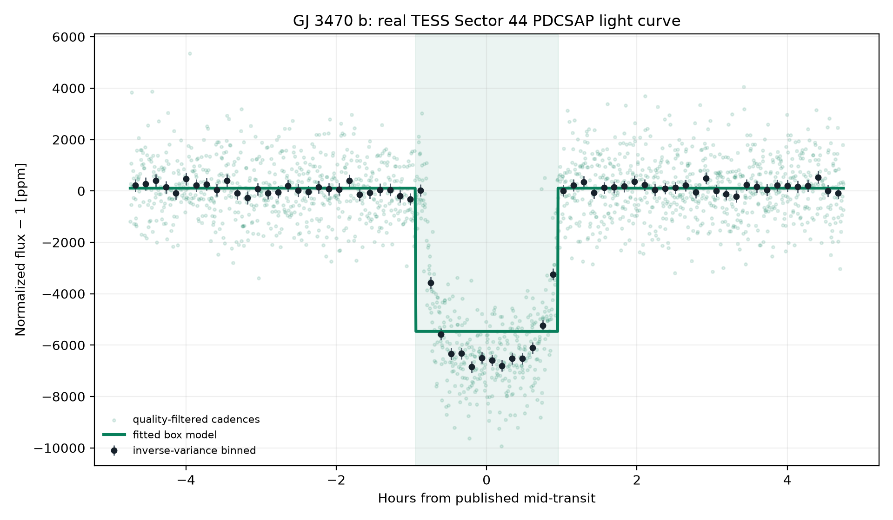
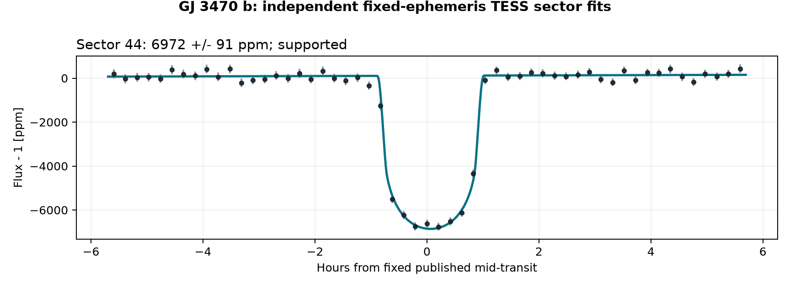
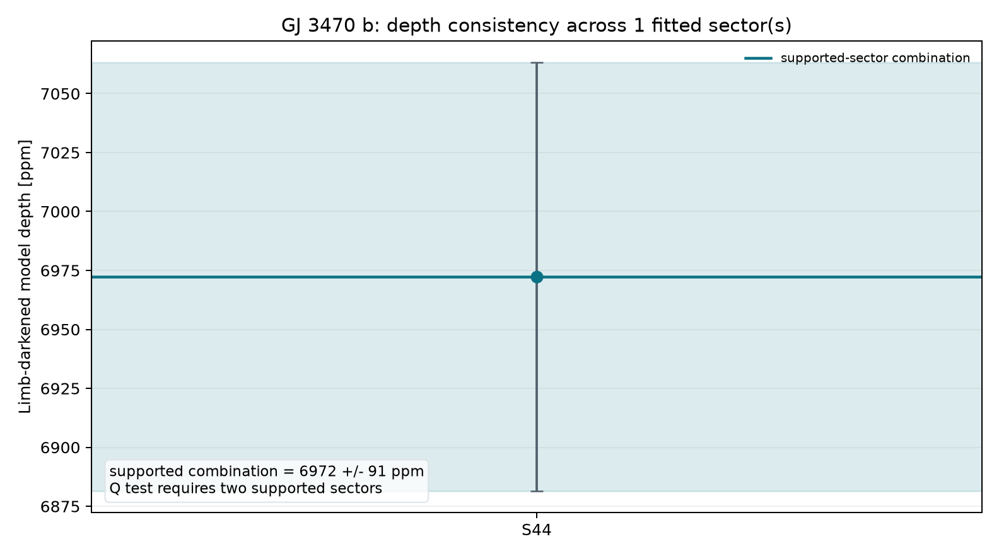
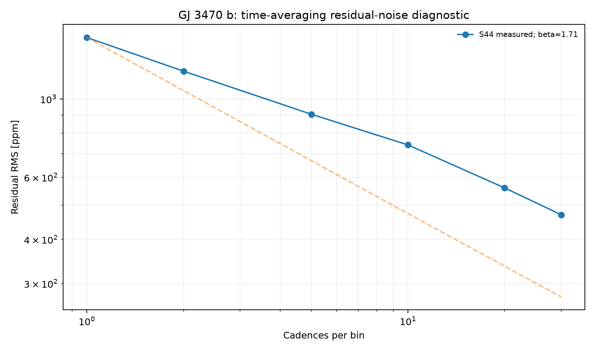
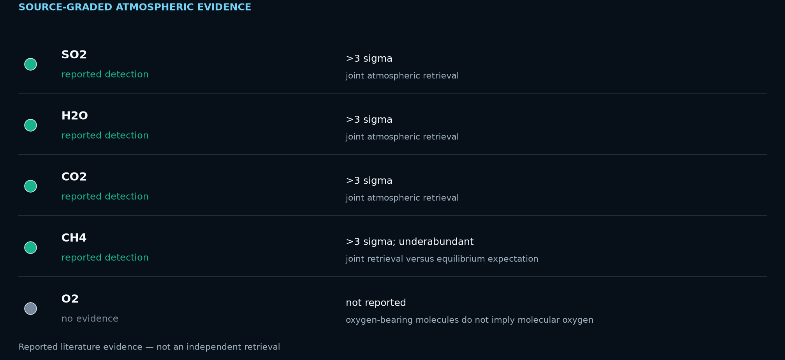

# GJ 3470 b: Sulfur Photochemistry on a Warm Neptune

<!-- TARGET-IDENTITY-START -->
<p align="center">
  
</p>

<p align="center"><em>AI-generated artist's interpretation informed by the measured system properties; not a direct image.</em></p>

**Warm Neptune · sulfur dioxide · JWST context + TESS**

A low-mass warm Neptune whose JWST spectrum reveals disequilibrium sulfur chemistry, paired with a reproducible TESS transit fit and a source-graded molecular evidence review.
<!-- TARGET-IDENTITY-END -->
<p align="center">
  
</p>


**[Open the full report](https://biswajit1999.github.io/gj3470b-exoplanet-report/)** — the live GitHub Pages version.

## Data sources

- **System parameters** — the saved `pscomppars` row from the [NASA Exoplanet Archive TAP service](https://exoplanetarchive.ipac.caltech.edu/TAP/sync?query=select+pl_name%2Chostname%2Cra%2Cdec%2Cpl_orbper%2Cpl_tranmid%2Cpl_trandur%2Cpl_rade%2Cpl_bmasse%2Cpl_eqt%2Cpl_orbsmax%2Csy_dist%2Csy_tmag%2Cst_teff%2Cst_rad%2Cst_mass%2Cdisc_year%2Cdiscoverymethod%2Cdisc_refname%2Cdisc_pubdate%2Cdisc_facility+from+pscomppars+where+pl_name%3D%27GJ+3470+b%27&format=csv).
- **Observed photometry** — unmodified MAST file `tess2021284114741-s0044-0000000019028197-0215-s_lc.fits`, TESS Sector 44, DOI [10.17909/t9-nmc8-f686](https://doi.org/10.17909/t9-nmc8-f686). This is a real SPOC reduced light curve, not simulated data.
- Exact URLs, IDs, retrieval date, and SHA-256 checksum are in [`data/SOURCE.md`](data/SOURCE.md).

## Reproduce the analysis

```bash
pip install -r requirements.txt
python scripts/analyze_transit.py
python scripts/analyze_multisector.py
python scripts/analyze_atmospheric_evidence.py
pytest tests/ -v
```

The script keeps finite `QUALITY == 0` cadences, normalizes `PDCSAP_FLUX`, and applies one symmetric robust outlier rule. A local linear null is compared with a circular quadratic-limb-darkened transit. The archive period and predicted phase are retained, while midpoint, radius ratio, impact parameter, baseline, and baseline slope are fitted inside a bounded window. The limb-darkening coefficients and scaled semi-major axis are fixed and disclosed in the CSV.

## What the corrected fit shows

| Quantity | Result |
|---|---:|
| TESS sector | 44 |
| Cadences in fitted window | 2235 |
| Transit support | ΔBIC ≥ 10 |
| Midpoint correction | +0.065 h ± 0.29 min |
| Model mid-transit depth | 6972.3 ± 81.0 ppm |
| Radius ratio Rp/Rs | 0.07605 |
| Fitted / published duration | 1.878 / 1.898 h |
| Linear null χ² / dof / BIC | 10061.03 / 2233 / 10076.46 |
| Transit χ² / dof / BIC | 2184.33 / 2230 / 2222.89 |
| ΔBIC (null − transit) | 7853.56 |

The timing-adjusted transit is strongly preferred by ΔBIC = 7853.6. Its fitted midpoint is +0.065 hours from the historical prediction; the model's mid-transit depth is 6972.3 ± 81.0 ppm. A fitted timing correction can diagnose ephemeris drift, but this single-sector fit is not a replacement for a global transit-timing analysis.

<!-- MULTISECTOR-UPGRADE-START -->
## Multi-sector robustness and correlated noise

The archive prediction was timing-adjusted independently in 1 fitted sector(s) (S44), of which 1 meet Delta BIC >= 10. Formal depth errors were inflated by sqrt(max(reduced chi-square, 1)) times the residual time-averaging beta factor (observed range 1.12-1.12). The robust inverse-variance model depth across supported sectors is 6972.3 +/- 90.8 ppm; a sector-to-sector Q test requires at least two supported sectors. These scaled errors address underestimated scatter and short-timescale correlation, but they are not a full Gaussian-process or physical limb-darkened transit fit.

<p align="center"></p>

<p align="center"></p>

<p align="center"></p>

The per-sector table is in [`figures/multisector_statistics.csv`](figures/multisector_statistics.csv). Regenerate all three figures with `python scripts/analyze_multisector.py`.
<!-- MULTISECTOR-UPGRADE-END -->

<!-- ATMOSPHERE-EVIDENCE-START -->
## Atmospheric evidence: detection, limit, or unknown?

> **Evidence scope — citation only; no spectrum bundled.** The molecular table and evidence graphic summarize the cited retrieval. This repository does not contain or reanalyze a reduced planetary spectrum.

<p align="center"></p>

The cited joint JWST, Hubble, and Spitzer retrieval reports four molecules above 3 sigma and interprets SO2 as disequilibrium photochemistry. This repository audits those published claims but does not re-run the atmospheric retrieval because its reduced spectrum is not bundled here.

| Species | Status | Evidence | Basis |
|---|---|---|---|
| SO2 | reported detection | >3 sigma | joint atmospheric retrieval |
| H2O | reported detection | >3 sigma | joint atmospheric retrieval |
| CO2 | reported detection | >3 sigma | joint atmospheric retrieval |
| CH4 | reported detection | >3 sigma; underabundant | joint retrieval versus equilibrium expectation |
| O2 | no evidence | not reported | oxygen-bearing molecules do not imply molecular oxygen |

Primary source: [Beatty et al. 2024, ApJL](https://doi.org/10.3847/2041-8213/ad55e9). The table is also available as [`data/atmospheric_evidence.csv`](data/atmospheric_evidence.csv). Oxygen-bearing species such as H2O, CO2, and SO2 are **not** evidence for molecular oxygen (O2) or a biosignature.
<!-- ATMOSPHERE-EVIDENCE-END -->

## System context

- Radius: 4.57 Earth radii
- Mass: 13.90 Earth masses
- Orbital period: 3.336650 days
- Transit duration: 1.898 hours
- Semi-major axis: 0.0355 AU
- Equilibrium temperature: 594 K
- Host: GJ 3470 · distance 29.42 pc
- Discovery: 2012 by Radial Velocity (La Silla Observatory)

## Limitations

- The orbit is assumed circular and the quadratic limb-darkening coefficients are fixed representative values; they are not atmosphere-grid interpolations.
- The scaled semi-major axis is derived from the saved composite semi-major axis and stellar radius; their uncertainties are not propagated.
- Midpoint freedom corrects accumulated ephemeris error but introduces a bounded timing search. ΔBIC, not a naïve one-parameter p-value, is used as the support gate.
- PDCSAP processing, dilution, stellar variability, transit-timing variations, and long-timescale covariance can still bias the inferred geometry.
- Radius ratio, impact parameter, and fixed limb darkening are correlated. Published global fits with physical priors and simultaneous detrending remain authoritative.

## Repository structure

```text
README.md
index.html
requirements.txt
data/                       unmodified TESS FITS + NASA row + SOURCE.md
scripts/analyze_transit.py  timing-adjusted limb-darkened transit fit
figures/                    generated plot + summary_statistics.csv
tests/                      real-data regression tests
.github/workflows/tests.yml CI on every push and pull request
LICENSE                     MIT
```

## References

1. [Bonfils et al. 2012](https://ui.adsabs.harvard.edu/abs/2012A%26A...546A..27B/abstract) — discovery reference as listed by the NASA Exoplanet Archive.
2. Ricker, G. R. et al. (2015), *Transiting Exoplanet Survey Satellite (TESS)*, JATIS 1, 014003, [doi:10.1117/1.JATIS.1.1.014003](https://doi.org/10.1117/1.JATIS.1.1.014003).
3. TESS Team, *TESS Light Curves — All Sectors*, MAST, [doi:10.17909/t9-nmc8-f686](https://doi.org/10.17909/t9-nmc8-f686); Sector 44 used here.
4. [NASA Exoplanet Archive](https://exoplanetarchive.ipac.caltech.edu/), `pscomppars` TAP row retrieved 2026-08-15.

## Author

Biswajit Jana — [Portfolio](https://biswajit1999.github.io/Biswajit_Jana.github.io/) · [GitHub](https://github.com/Biswajit1999) · [LinkedIn](https://www.linkedin.com/in/biswajit-jana-27011a151/) · [ORCID](https://orcid.org/0009-0002-2411-1891)
